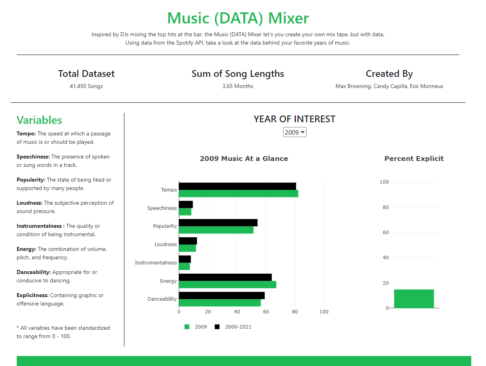
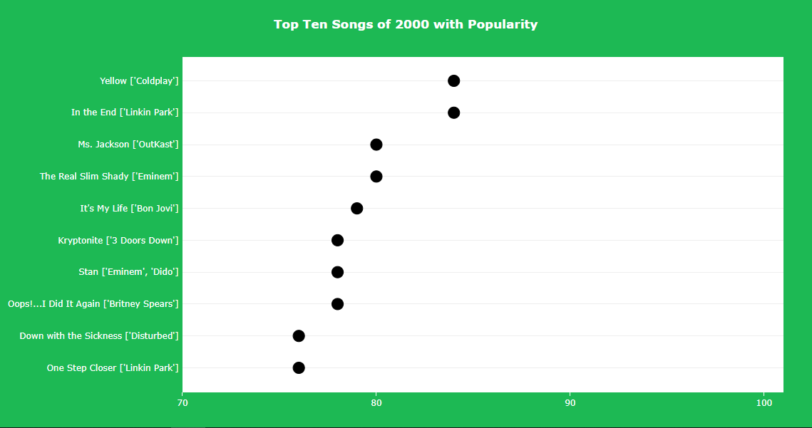

## Spotify_project_-G1

Over the course of 2 weeks, we used data taken from [Kaggle](https://www.kaggle.com/yamaerenay/spotify-dataset-19212020-160k-tracks?select=data_by_genres.csv) to create informational interactive graphs. Our original data contained over 160k songs, which we then narrowed down to 41,450k to focus on a certain years of interst (2000-2020).

## The following steps were taken in order to complte this project:

# Front- end 
Using javacript and html coding, we created an interface that shows the user a summary of our data

* Our horizontal bar graph shows specific music variables used to create music in certain years. 
* Stacked bar visually shows which years had more explicit songs.
* Scattered graph shows the top 10 songs for choosen year. 

# Back- end 
* We set up a dabase using sql and importing the cvs file.
See the code here:
* we the created a API for our sql.
See the code here:
* We consumed the API using sqlachemy to connect to the sql database and tranform it into a json data.
See the code here:
* Using d3.json we read the data into the javascript plotly to make the graphs 
See the code [Here](static/Js/app.js)

